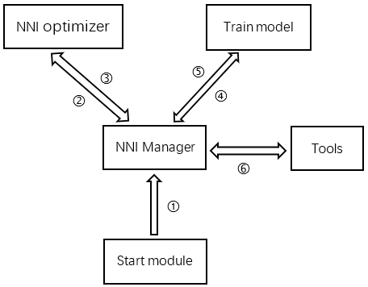

[TOC]


## Hyperparameter Optimization




​		***流程细节可看最后一节pipeline.***

### Manager

#### 1）启动文件

- **任务配置文件**

```yml
authorName: default
maxTrialNum: 8
searchSpacePath: /path to/search_space.json
tuner:
  #choice: TPE, Random, Anneal, 
  tuner_class_name: TPE 
  tuner_args:
    #choice: maximize, minimize
    optimize_mode: maximize
assessor:
  #choice: Medianstop, Curvefitting
  assessor_class_name: Curvefitting
  assessor_args:
    #choice: maximize, minimize
    optimize_mode: maximize
    epoch_num: 20
    threshold: 0.9 
```

- **搜索空间文件**

```yml
{
    "dropout_rate":{"_type":"uniform","_value":[0.5, 0.9]},
    "conv_size":{"_type":"choice","_value":[2,3,5,7]},
    "hidden_size":{"_type":"choice","_value":[124, 512, 1024]},
    "batch_size": {"_type":"choice", "_value": [1, 4, 8, 16, 32]},
    "learning_rate":{"_type":"choice","_value":[0.0001, 0.001, 0.01, 0.1]}
}
```

- **将配置文件和搜索空间文件json形式发送给web ui模块**

#### 2）解析文件

- **解析配置文件**

  解析配置文件，并以命令形式：

  ```json
  start_opt
  {
   "tuner_class_name":'TPE',
   "tuner_args":'maximize',
   "assessor_class_name":'Curvefitting',
   "assessor_args":{"optimize_mode":'maximize',"epoch_num":'20',"threshold":0.9}
  }
  ```

  发送到 NNI optimizer 环境指定的 opt-receive.txt 文件

- **解析搜索空间文件**

  解析搜索空间文件，并以命令形式：

  ```json
  IN  
  {
   "dropout_rate": {"_type": "uniform", "_value": [0.5, 0.9]}, 
   "conv_size": {"_type": "choice", "_value": [2, 3, 5, 7]}, 
   "hidden_size": {"_type": "choice", "_value": [124, 512, 1024]}, 
   "batch_size": {"_type": "choice", "_value": [1, 4, 8, 16, 32]}, 	  "learning_rate": {"_type": "choice", "_value": [0.0001, 0.001, 0.01, 0.1]}
  }
  ```

  发送到 NNI optimizer 环境指定的 opt-receive.txt 文件

#### 3）超参数请求

读取NNI optimizer 环境指定的 opt-send.txt 文件，当收到:

```json
ID 
```

表示NNI optimizer初始化成功。


自定义一组超参数名称：

```python
trial1
```


开始向 opt-receive.txt 发送：

```json
b'GE1'
```

请求一组超参数。


读取 opt-send.txt 文件，收到：

```json
b'TR
{
 "parameter_id": 0, 
 "parameter_source": "algorithm", 
 "parameters": {
     "dropout_rate": 0.8962242979199216, 
     "conv_size": 7, 
     "hidden_size": 124, 
     "batch_size": 8, 
     "learning_rate": 0.1
 				}
}'
```

#### 4）超参数发送

1. 获取到超参数后，将超参数发送到 train model 环境指定目录下的 parameter.json
2. 启动 train model 环境，读取parameter.json超参数进行训练。

#### 5）捕获train model 的日志

- **当字段包含val metric:x.xx时，**

  向NNI optimizer 发送 ：

  ```json
  b'ME
  {
   "parameter_id": 0, 
   "trial_job_id": "trial1", 
   "type": "PERIODICAL", 
   "sequence": 0, 
   "value": x.xx
  }
  '
  ```

  “parameter_id“ 字段 表示是第几组参数，起始为0

  "sequence" 字段每发一次val metric 就 += 1

- **当字段包含final metric:x.xx时,**

  向NNI optimizer 发送 ：

  ```json
  b'ME
  {
   "parameter_id": 0, 
   "trial_job_id": "trial1", 
   "type": "FINAL", 
   "sequence": 0, 
   "value": x.xx
  }
  '
  ```

  “parameter_id” 字段 表示是第几组参数，起始为0

  “sequence” 字段 一直为 0

- **同时将metric发送给web ui**

  ```json
  {
  "trial_job_id": "trial1",
  "type": "VAL or FINAL",
  "value": x.xx 
  }
  ```

#### 6）Early stop

发送完val metric后，当收到NNI optimizer发送的：

```json
b'KItrial1'
```

结束 trial_job_id = trial1的训练，同时发送metric给web ui

```json
 {
 "trial_job_id": "trial1",
 "type": "FINAL",
 "value": "上一次 val metric"
 }
```
#### 7）一组超参训练结束

当收到向NNI optimizer 发送完final metric 或者 收到 Early stop 并结束train 后，向NNI optimizer发送：

```json
b'EN
{"trial_job_id":"trial1",
 "event":"SUCCEEDED",
 "hyper_params":{"parameter_id": 0,
                 "parameter_source": "algorithm", 
                 "parameters": 
                 {
                     "dropout_rate": 0.8962242979199216, 
                                "conv_size": 7, 
                                "hidden_size": 124, 
                                "batch_size": 8, 
                                "learning_rate": 0.1
                 }
                }
}
```


### optimizer

#### 1）启动NNI optimizer

- 收到命令：

  ```json
  start_opt
  {
   "tuner_class_name":'TPE',
   "tuner_args":'maximize',
   "assessor_class_name":'Curvefitting',
   "assessor_args":{"optimize_mode":'maximize',"epoch_num":'20',"threshold":0.9}
  }
  ```

- 启动 主文件

  ```shell
  run main -tuner_class_name 'TPE' -tuner_args maximize - assessor_class_name ...
  ```

#### 2）搜索空间初始化

- 收到命令：

  ```json
  IN  
  {
   "dropout_rate": {"_type": "uniform", "_value": [0.5, 0.9]}, 
   "conv_size": {"_type": "choice", "_value": [2, 3, 5, 7]}, 
   "hidden_size": {"_type": "choice", "_value": [124, 512, 1024]}, 
   "batch_size": {"_type": "choice", "_value": [1, 4, 8, 16, 32]}, 	  "learning_rate": {"_type": "choice", "_value": [0.0001, 0.001, 0.01, 0.1]}
  }
  ```

- 调用初始化函数 - self.handle_initialize

- 初始化成功并返回给NNI Manager

  ```json
  b'ID'
  ```

#### 3) 收到超参数请求

- 收到命令：

  ```json
  b'GE1'
  ```

- 调用超参数生成函数 - self.handle_request_trial_jobs

- 超参数生成功并返回给NNI Manager

  ```json
  b'TR
  {
   "parameter_id": 0, 
   "parameter_source": "algorithm", 
   "parameters": {
       "dropout_rate": 0.8962242979199216, 
       "conv_size": 7, 
       "hidden_size": 124, 
       "batch_size": 8, 
       "learning_rate": 0.1
   				}
  }'
  ```

#### 4) 处理val metric

- 收到命令：

  ```json
  b'ME
  {
   "parameter_id": 0, 
   "trial_job_id": "trial1", 
   "type": "PERIODICAL", 
   "sequence": 0, 
   "value": x.xx
  }
  '
  ```

- 调用结果处理函数 - self.handle_report_metric_data

  当满足 Early stop 情况时，返回给NNI Manager

  ```json
  b'KI"trial_job_id"'
  ```

  否则无返回值

#### 5）处理 final metric

- 收到命令：

  ```json
  b'ME
  {
   "parameter_id": 0, 
   "trial_job_id": "trial1", 
   "type": "FINAL", 
   "sequence": 0, 
   "value": x.xx
  }
  '
  ```

- 调用更新优化器函数self._handle_intermediate_metric_data()

- 无返回值

#### 6）处理一组超参训练结束

- 收到命令:

  ```json
  b'EN
  {"trial_job_id":"trial1",
   "event":"SUCCEEDED",
   "hyper_params":{"parameter_id": 0,
                   "parameter_source": "algorithm", 
                   "parameters": 
                   {
                       "dropout_rate": 0.8962242979199216, 
                                  "conv_size": 7, 
                                  "hidden_size": 124, 
                                  "batch_size": 8, 
                                  "learning_rate": 0.1
                   }
                  }
  }
  ```

- 调用end函数 - self.handle_trial_end

- 无返回值

#### 7)命令集

```python
class CommandType(Enum):
    # in
    Initialize = b'IN'
    RequestTrialJobs = b'GE'
    ReportMetricData = b'ME'
    UpdateSearchSpace = b'SS'
    ImportData = b'FD'
    AddCustomizedTrialJob = b'AD'
    TrialEnd = b'EN'
    Terminate = b'TE'
    Ping = b'PI'

    # out
    Initialized = b'ID'
    NewTrialJob = b'TR'
    SendTrialJobParameter = b'SP'
    NoMoreTrialJobs = b'NO'
    KillTrialJob = b'KI'
```


### Train Model

#### 读取参数

读取指定目录下 parameter.json,运行模型训练


### Pipeline


